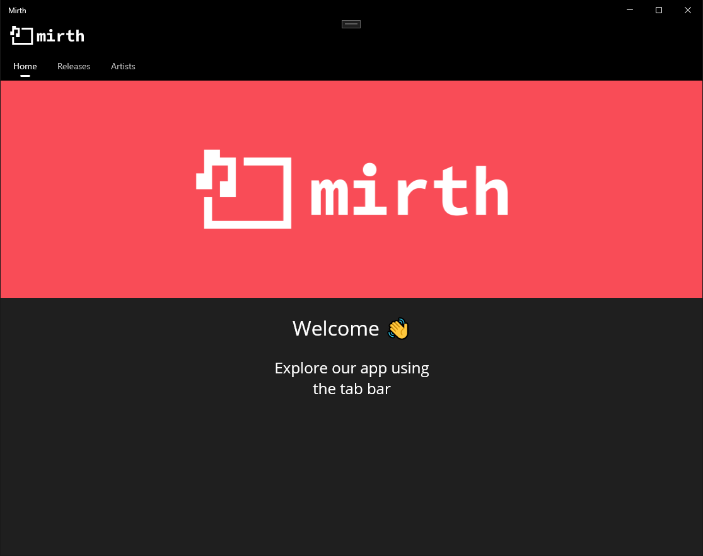
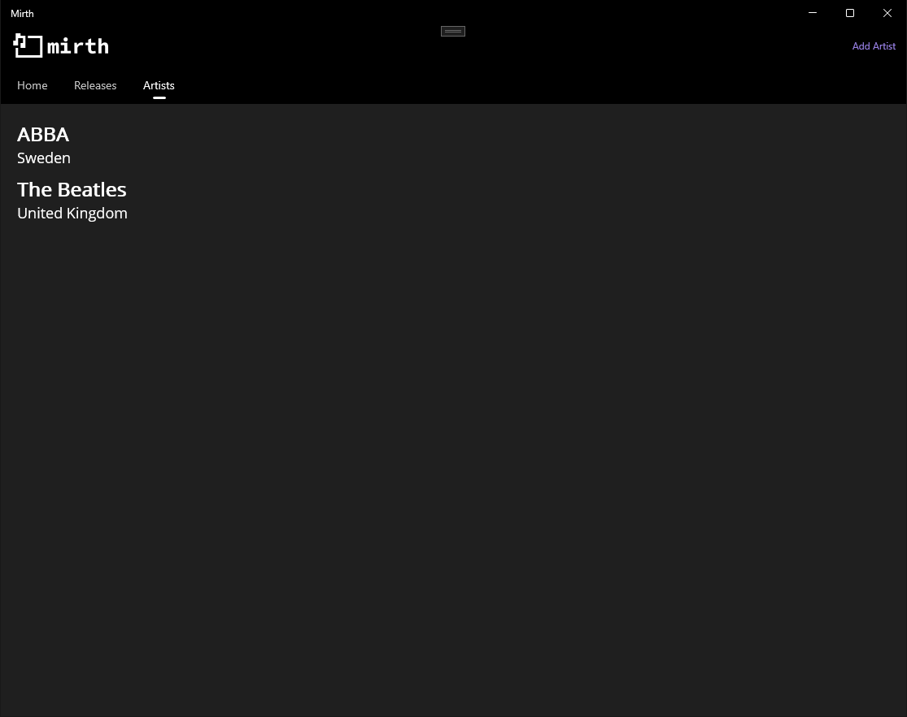
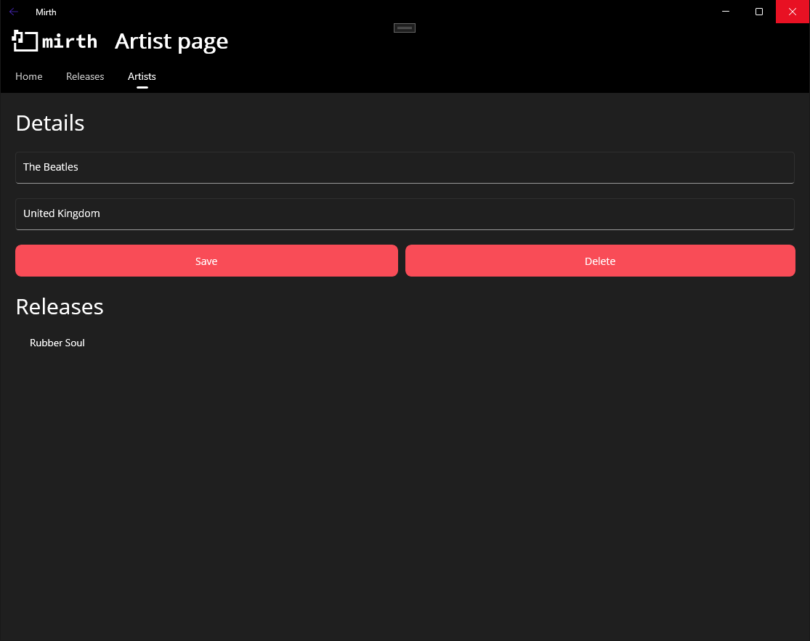
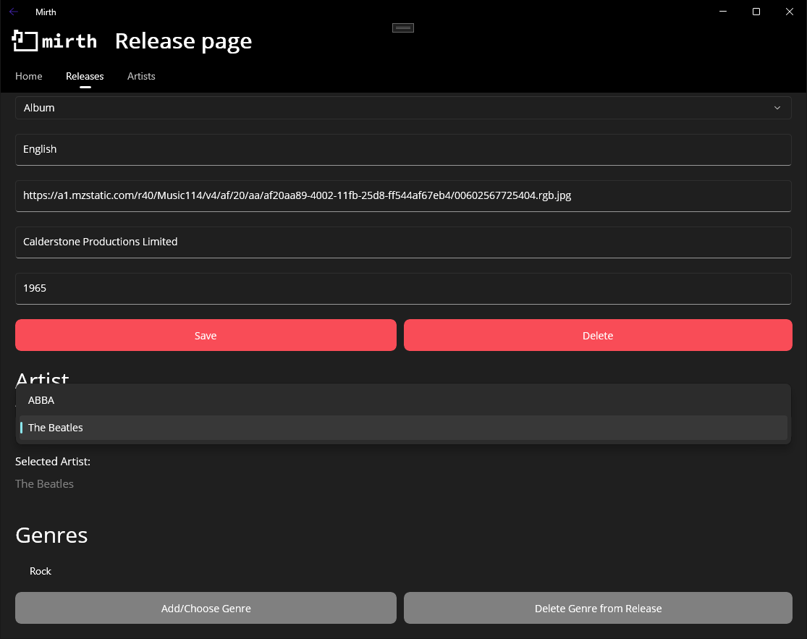
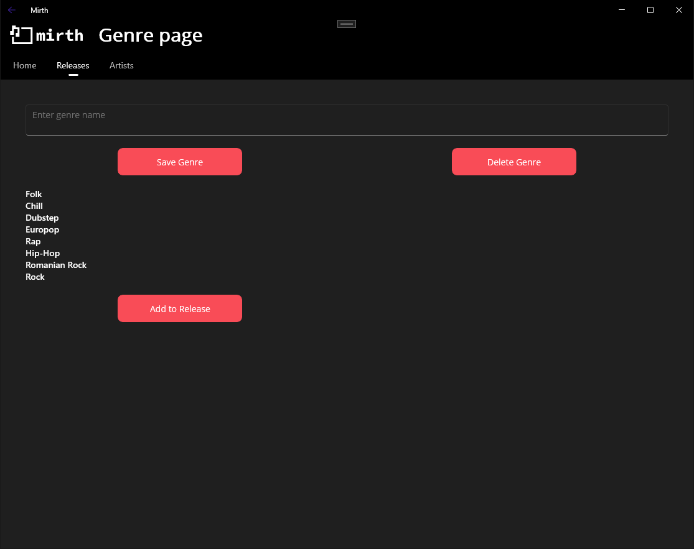

## Mirth

Mirth is a music library organization app developed by me and my colleague [Radu](https://github.com/ciurca) during university. This application allows users to manage their music library by adding artists, albums and genres, providing a convenient way to organize their music collection. The project consists of two parts: a web app (developed by [Radu](https://github.com/ciurca)) and a mobile application (developed by me).

### Technologies
##### Web Application
- Framework: ASP.NET Razor Pages
- Database: MS SQL Server
- Frontend: HTML, CSS, JavaScript

##### Mobile Application
- Framework: .NET MAUI
- Database: SQLite
- Frontend: XAML

### Features 

##### Artists

Users can easily add new artists to their library by providing their name and country. Each artist page will display their releases.

##### Releases

To add a release users have to provide details like name, release type, language and artwork. To add an artist to a release users can choose from a list of existing artists using a dropdown menu. Finally, users can add an existing genre or create a new one to enrich their library with useful information about releases.

##### Genres

New genres can be added from the release creation page. When pressing the "Add/Choose Genre" button users are taken to a page which allows them to add a new genre or delete existing ones.

